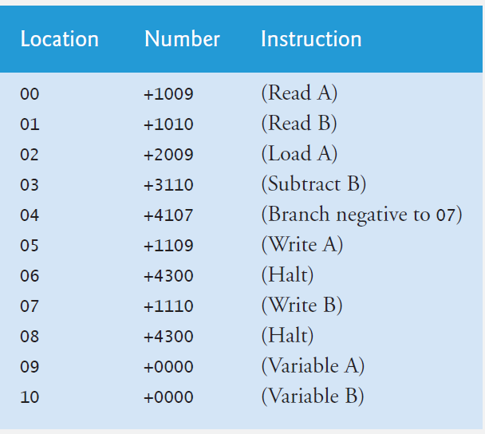

# Simpletron Machine Language

## File Contents

The **interpreter.cpp** file contains code for the Simpletron Machine Language interpreter. Functionality is tested using predefined instructions as opposed to user input.  

The **main.cpp** file is a revision of **interpreter.cpp**. It receives and executes instructions from user input. At the end of program execution, a memory dump is printed to screen.

## Introduction

Let’s create a computer we’ll call the Simpletron. As its
name implies, it’s a simple machine, but, as we’ll soon see, it’s a powerful one as well. The Simpletron
runs programs written in the only language it directly understands, that is, Simpletron Machine
Language, or SML for short.

 The Simpletron contains an accumulator—a “special register” in which information is put
before the Simpletron uses that information in calculations or examines it in various ways. All
information in the Simpletron is handled in terms of words. A word is a signed four-digit decimal
number, such as +3364, -1293, +0007, -0001, etc. The Simpletron is equipped with a 100-word
memory, and these words are referenced by their location numbers 00, 01, …, 99.
Before running an SML program, we must load, or place, the program into memory. The first
instruction (or statement) of every SML program is always placed in location 00. The simulator
will start executing at this location.
Each instruction written in SML occupies one word of the Simpletron’s memory; thus,
instructions are signed four-digit decimal numbers. Assume that the sign of an SML instruction is
always plus, but the sign of a data word may be either plus or minus. Each location in the Simpletron’s
memory may contain an instruction, a data value used by a program or an unused (and
hence undefined) area of memory. The first two digits of each SML instruction are the operation
code that specifies the operation to be performed.

### Input/output operations

const int read = 10; Read a word from the keyboard into a specific location in
memory.

const int write = 11; Write a word from a specific location in memory to the screen.
Load and store operations

const int load = 20; Load a word from a specific location in memory into the
accumulator.

const int store = 21; Store a word from the accumulator into a specific location in
memory.

### Arithmetic operations
const int add = 30; Add a word from a specific location in memory to the word
in the accumulator (leave result in accumulator).

const int subtract = 31; Subtract a word from a specific location in memory from the
word in the accumulator (leave result in accumulator).

const int divide = 32; Divide a word from a specific location in memory into the
word in the accumulator (leave result in accumulator).

const int multiply = 33; Multiply a word from a specific location in memory by the
word in the accumulator (leave result in accumulator).

### Transfer-of-control operations

const int branch = 40; Branch to a specific location in memory.

const int branchneg = 41; Branch to a specific location in memory if the accumulator is
negative.

const int branchzero = 42; Branch to a specific location in memory if the accumulator is
zero.

const int halt = 43; Halt—the program has completed its task.

## Sample Program

The SML program below reads two numbers from the keyboard, then determines and
displays the larger value. Note the use of the instruction +4107 as a conditional transfer of control,
much the same as C++’s if statement.

  

### Sample Program Output

<pre>(base) <b>broncop@BroncoP</b>:<b>~/Documents/C++/CPP11/CPP_Projects/Machine Language</b>$ ./a.out
*** Welcome to Simpletron! ***

*** Please enter your program one instruction ***
*** (or data word) at a time. I will type the ***
*** location number and a question mark (?).  ***
*** You then type the word for that location. ***
*** Tyoe the sentinel -99999 to stop entering ***
*** your program. ***

00 ? 1009
01 ? 1010
02 ? 2009
03 ? 3110
04 ? 4107
05 ? 1109
06 ? 4300
07 ? 1110
08 ? 4300
09 ? -99999

Running program...
Enter an integer to memory location 0x7ffc4bf8d614: 4
Enter an integer to memory location 0x7ffc4bf8d618: 6
Loading 4 from memory 0x7ffc4bf8d614 to accumulator...Done.
Accumulator value 4
Subtract 6 to accumulator: 4 + 6 = -2
0x7ffc4bf8d618 value is 6

REGISTERS:
accumulator          -0002
instructionCounter      08
instructionRegister  +4300
operationCode           43
operand                 00

MEMORY:
       0     1     2     3     4     5     6     7     8     9
 0 +1009 +1010 +2009 +3110 +4107 +1109 +4300 +1110 +4300 +0004
10 +0006 +0000 +0000 +0000 +0000 +0000 +0000 +0000 +0000 +0000
20 +0000 +0000 +0000 +0000 +0000 +0000 +0000 +0000 +0000 +0000
30 +0000 +0000 +0000 +0000 +0000 +0000 +0000 +0000 +0000 +0000
40 +0000 +0000 +0000 +0000 +0000 +0000 +0000 +0000 +0000 +0000
50 +0000 +0000 +0000 +0000 +0000 +0000 +0000 +0000 +0000 +0000
60 +0000 +0000 +0000 +0000 +0000 +0000 +0000 +0000 +0000 +0000
70 +0000 +0000 +0000 +0000 +0000 +0000 +0000 +0000 +0000 +0000
80 +0000 +0000 +0000 +0000 +0000 +0000 +0000 +0000 +0000 +0000
90 +0000 +0000 +0000 +0000 +0000 +0000 +0000 +0000 +0000 +0000

</pre>
